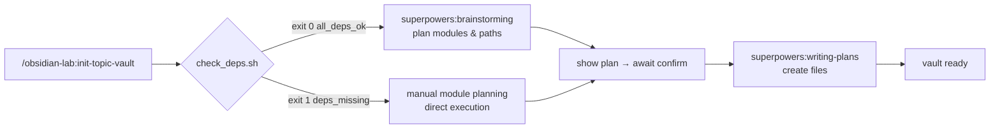

# obsidian-lab

> A Claude Code plugin that initializes a complete Obsidian topic learning vault in a single command.


[中文](./README.zh.md)

---

## Why

Every time you start an Obsidian vault for a new learning topic, you manually:

- Build the directory structure (numbered module folders)
- Write `CLAUDE.md` (conventions, tag taxonomy, progressive documentation rules)
- Create the index, module READMEs, and initial document stubs one by one

**obsidian-lab compresses all of this into a single command.**

---

## Quick Start

After installation (see [Installation](#installation) below), open Claude Code in any empty directory:

```text
/obsidian-lab:init-topic-vault "Rust Learning"
```

---

## What You Get

A single command generates the following in the current directory:

```
Rust Learning/
├── 00-index/
│   ├── 知识图谱.md       ← wikilink index of all modules
│   └── 学习路径.md       ← recommended learning order
├── 01-基础语法/
│   ├── README.md         ← module navigation
│   ├── 变量与类型速查.md  ← quick-ref
│   └── 所有权概念.md     ← notes
├── 02-所有权系统/
│   └── ...
├── _assets/              ← images & attachments
├── _templates/           ← document templates
└── CLAUDE.md             ← customized working conventions
```

The generated `CLAUDE.md` automatically includes:

- Obsidian document rules (wikilinks, callouts, frontmatter)
- Progressive documentation principles (word limits for quick-ref / notes / deep-dive)
- Tag taxonomy (module layer + type layer + status layer)
- Update workflow

---

## How It Works



---

## Installation

```text
/plugin marketplace add VisionTang/obsidian-lab
/plugin install obsidian-lab@obsidian-lab
```

Restart Claude Code after installation.

### Dependencies (optional)

When present, the full workflow runs; otherwise the skill falls back gracefully:

| Plugin | Skill | Purpose |
|--------|-------|---------|
| `superpowers` | `brainstorming` | Interactively plan module structure and learning path |
| `superpowers` | `writing-plans` | Generate a task plan with all file paths |
| `obsidian` | `obsidian-markdown` | Create Obsidian-compliant frontmatter and document structure |

Verify dependencies (run inside Claude Code — `<base_dir>` is provided automatically):

```bash
bash <base_dir>/skills/init-topic-vault/scripts/check_deps.sh
```

---

## License

MIT
