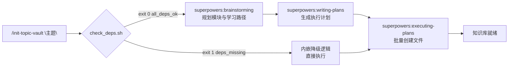

# obsidian-lab

> Claude Code plugin：一条指令初始化完整的 Obsidian 主题学习知识库。


[English](./README.md)

---

## 为什么用它

每次针对新主题创建 Obsidian 知识库，你都要手动：

- 建目录结构（数字前缀模块）
- 写 `CLAUDE.md`（规范、Tags 体系、渐进式文档原则）
- 逐一创建索引、模块 README、初始文档骨架

**obsidian-lab 把这一切压缩成一条命令。**

---

## 快速开始

安装后（见下方[安装](#安装)章节），在任意空目录打开 Claude Code：

```text
/obsidian-lab:init-topic-vault "Rust学习"
```

---

## 生成效果

运行一条命令后，在当前目录自动生成：

```
Rust学习/
├── 00-index/
│   ├── 知识图谱.md       ← 所有模块 wikilink 索引
│   └── 学习路径.md       ← 推荐学习顺序
├── 01-基础语法/
│   ├── README.md         ← 模块导航
│   ├── 变量与类型速查.md  ← quick-ref
│   └── 所有权概念.md     ← notes
├── 02-所有权系统/
│   └── ...
├── _assets/              ← 图片/附件
├── _templates/           ← 文档模板
└── CLAUDE.md             ← 定制化工作规范
```

生成的 `CLAUDE.md` 自动包含：

- Obsidian 文档规则（wikilink、callout、frontmatter）
- 渐进式文档原则（quick-ref / notes / deep-dive 字数限制）
- Tags 体系（模块层 + 类型层 + 状态层）
- 更新迭代流程

---

## 工作流



---

## 安装

```bash
git clone https://github.com/<username>/obsidian-lab ~/.claude/plugins/obsidian-lab
```

### 依赖（可选）

以下 plugin 存在时走完整流程，缺失时自动降级执行：

| Plugin | Skill | 用途 |
|--------|-------|------|
| `superpowers` | `brainstorming` | 交互式规划模块结构与学习路径 |
| `superpowers` | `writing-plans` | 生成包含所有文件路径的执行计划 |
| `obsidian` | `obsidian-markdown` | 创建符合 Obsidian 规范的 frontmatter 和文档结构 |

手动验证依赖：

```bash
bash ~/.claude/plugins/obsidian-lab/skills/init-topic-vault/scripts/check_deps.sh
```

---

## 许可证

MIT
