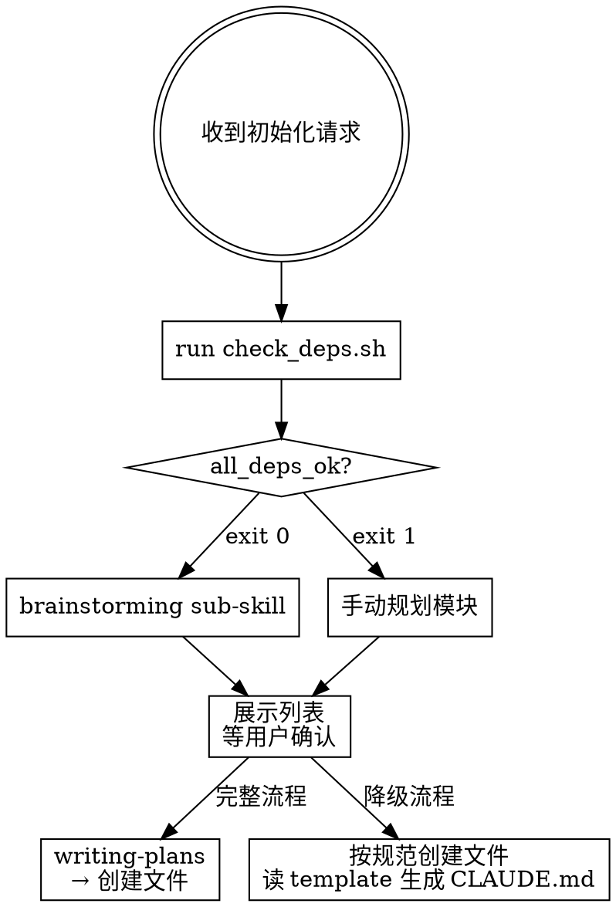

# Obsidian 主题学习知识库初始化

## Overview

为任意主题创建结构化的 Obsidian 学习知识库。核心原则：**先检测依赖 → 再规划模块（等待用户确认）→ 最后创建文件**，三步缺一不可。



## When to Use

- 用户要求初始化、创建一个新的 Obsidian 知识库
- 用户提供了主题名（如"Rust"、"机器学习"、"Docker"）
- 当前目录是空的或准备存放知识库的目录

**不适用：** 向已有知识库添加内容、整理已有笔记

---

## 第一步：依赖检测（不可跳过，包括在提问之前）

> **为什么不能跳过：** dep check 决定走哪条流程。跳过直接创建文件等于在不知道用户环境的情况下做决策。
>
> **不要在 dep check 之前提问澄清需求。** 用户的学习目标由 brainstorming 负责收集，dep check 是任何其他行动的前提。

运行 `scripts/check_deps.sh` 检测依赖（`<base_dir>` 来自系统提示中 `Base directory for this skill:`）：

```bash
bash <base_dir>/scripts/check_deps.sh
```

- **输出 `all_deps_ok`（exit 0）** → 执行下方"完整流程"
- **输出 `deps_missing`（exit 1）** → 告知用户缺少哪些 plugin，执行下方"降级流程"

---

## 完整流程（all_deps_ok）

**REQUIRED SUB-SKILL:** 注入以下上下文后调用 `superpowers:brainstorming`：

> 我们正在为 **[主题名]** 初始化一个 Obsidian 学习知识库。
>
> **约束条件：**
> - 这是个人学习知识库，不是软件项目
> - 模块使用数字前缀目录（`01-xxx/`），建议 5-8 个模块
> - 每个模块规划初始文档：至少 1 篇 quick-ref + 1 篇 notes，核心模块可加 deep-dive
> - 最终产物：目录结构 + CLAUDE.md + 各模块 README + 初始文档骨架
> - 不涉及技术架构、测试、CI/CD 等软件工程概念
>
> **brainstorming 输出：**
> 1. 模块列表（带数字前缀和中文名）
> 2. 每个模块的初始文档清单（文件名 + 类型 quick-ref/notes/deep-dive）
> 3. 学习路径建议（模块学习顺序）
> 4. 知识图谱结构（模块间依赖关系）

brainstorming 完成后，**展示模块列表等待用户确认**，确认后调用 **REQUIRED SUB-SKILL:** `superpowers:writing-plans`，生成包含所有文件路径和内容的执行计划。

---

## 降级流程（deps_missing）

**Obsidian 规范：** 读取 `<base_dir>/references/obsidian-conventions.md`

### 1. 规划模块（先规划，再等待确认）

根据主题分析，生成 5-8 个模块，每个模块包含：
- 数字前缀目录名（如 `01-基础概念/`）
- 初始文档清单（至少 1 quick-ref + 1 notes）

**展示模块列表，等待用户确认后再继续。** 不要在确认前创建任何文件。

### 2. 创建文件结构

用户确认后，按以下结构创建（遵循 obsidian-conventions.md 中的文档规范）：

```
<当前目录>/
├── 00-index/
│   ├── 知识图谱.md      ← 列出所有模块的 wikilink
│   └── 学习路径.md      ← 建议的学习顺序
├── 01-<模块名>/
│   ├── README.md        ← 模块导航，列出所有文件 wikilink
│   └── <初始文档>.md
├── 02-<模块名>/
│   └── ...
├── _assets/
├── _templates/
└── CLAUDE.md
```

### 3. 生成 CLAUDE.md

读取 `<base_dir>/assets/CLAUDE.md.template`，替换占位符：
- `{{TOPIC}}` → 实际主题名
- `{{MODULES}}` → 根据模块列表生成的 tag 英文值（如 `basics` `ownership` `lifetime`）

**不要从零编写 CLAUDE.md**，必须使用 template 替换。

---

## Quick Reference

| 步骤 | 完整流程（all_deps_ok） | 降级流程（deps_missing） |
|------|------------------------|--------------------------|
| 1. 依赖检测 | `bash check_deps.sh` → exit 0 | `bash check_deps.sh` → exit 1 |
| 2. 规划模块 | 调用 `superpowers:brainstorming` | 手动分析主题，生成 5-8 模块 |
| 3. 等待确认 | 展示模块列表 → **等用户确认** | 展示模块列表 → **等用户确认** |
| 4. 创建文件 | 调用 `superpowers:writing-plans` → 按计划执行 | 按目录结构直接创建 |
| 5. CLAUDE.md | 读 `CLAUDE.md.template` → 替换 `{{TOPIC}}` `{{MODULES}}` | 同左 |

---

## Common Mistakes

| 错误行为 | 正确做法 |
|---------|---------|
| 跳过 `check_deps.sh`，直接开始创建文件 | 第一步必须运行 dep check，结果决定走哪条流程 |
| dep check 之前先向用户提问澄清需求 | dep check 是第一步，提问是 brainstorming 的职责 |
| 跳过 brainstorming，直接用直觉规划模块 | 完整流程必须先调用 `superpowers:brainstorming` |
| 规划完模块后立即创建文件 | 必须展示模块列表，等用户确认后才能创建 |
| 从零编写 CLAUDE.md 内容 | 必须读取 `CLAUDE.md.template` 并替换占位符 |
| 完整流程中忘记调用 `writing-plans` | brainstorming 结束后必须调用 `superpowers:writing-plans` 生成执行计划 |
| "用户已给出模块列表" → 跳过展示确认步骤 | 必须展示完整规划（模块 + 初始文档清单）等待确认，不论模块名来自谁 |
